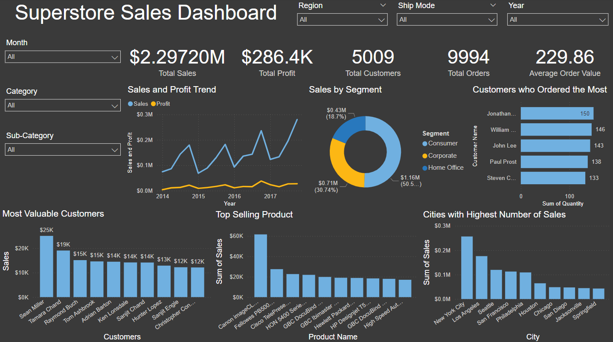

# Sales Analysis Report using Power BI

This repository contains a sales analysis dashboard created using Power BI.

## Files
- `Sales Analysis Dashboard.pdf`: PDF version of the sales analysis report.
- `dashboard_image.png`: Screenshot of the dashboard for a quick view.
- `Sales Analysis Dashboard.pbix`: Power BI report file for interactive exploration.
- `Dataset Link`: [Download Dataset](https://www.kaggle.com/datasets/vivek468/superstore-dataset-final)

## Overview
The dashboard includes the following insights:
- **Total Sales**: $2.29720M
- **Total Profit**: $286.4K
- **Total Orders**: 9994
- **Average Order Value**: $229.86
- **Total Customers**: 5009

### Detailed Insights:
- **Sales and Profit Trends**: Analyzed over time to show seasonal impacts and growth trends.
- **Sales by Segment**: Breakdown by Consumer, Corporate, and Home Office segments.
- **Top Customers**: Highlighting the most valuable customers based on sales.
- **Top-Selling Products**: Listing products with the highest sales figures.
- **City-wise Sales**: Visualizing the cities with the highest sales.
- **State-wise Sales and Profit Analysis**: Comprehensive view of sales and profit margins across states.
- **Year-over-Year Sales by Category**: Showing sales growth for different product categories over the years.
- **Year-over-Year Sales by Region**: Analysis of sales trends across different regions.
- **Profit Trends by Month and Year**: Monthly profit trends for detailed financial analysis.
- **Profit by Category, Segment, Ship Mode, and Region**: Detailed profit analysis across various dimensions.

## Usage
- **PDF Report**: Download the `Sales Analysis Dashboard.pdf` file to view the detailed report.
- **Interactive Report**: Download the `Sales Analysis Dashboard.pbix` file to interact with the data using Power BI Desktop.
- **Dataset**: Download the dataset used in this analysis from the following link: [Download Dataset](https://www.kaggle.com/datasets/vivek468/superstore-dataset-final)
  

## Preview


## How to Use This Repository
1. **Clone the Repository**:
    ```sh
    git clone https://github.com/gangadhar107/Sales-Analysis-Report-using-Power-BI.git
    ```
2. **View the PDF**:
    - Download and open `Sales Analysis Dashboard.pdf` to see the complete report.
3. **Explore the Dashboard**:
    - Download the `Sales Analysis Dashboard.pbix` file and open it with Power BI Desktop to interact with the dashboard.
4. **Download the Dataset**:
    - Download the dataset from the link provided in the `Dataset Link` section above.

## Contribution
Feel free to fork this repository and submit pull requests. For major changes, please open an issue first to discuss what you would like to change.

## License
This project is licensed under the MIT License - see the `LICENSE` file for details.
